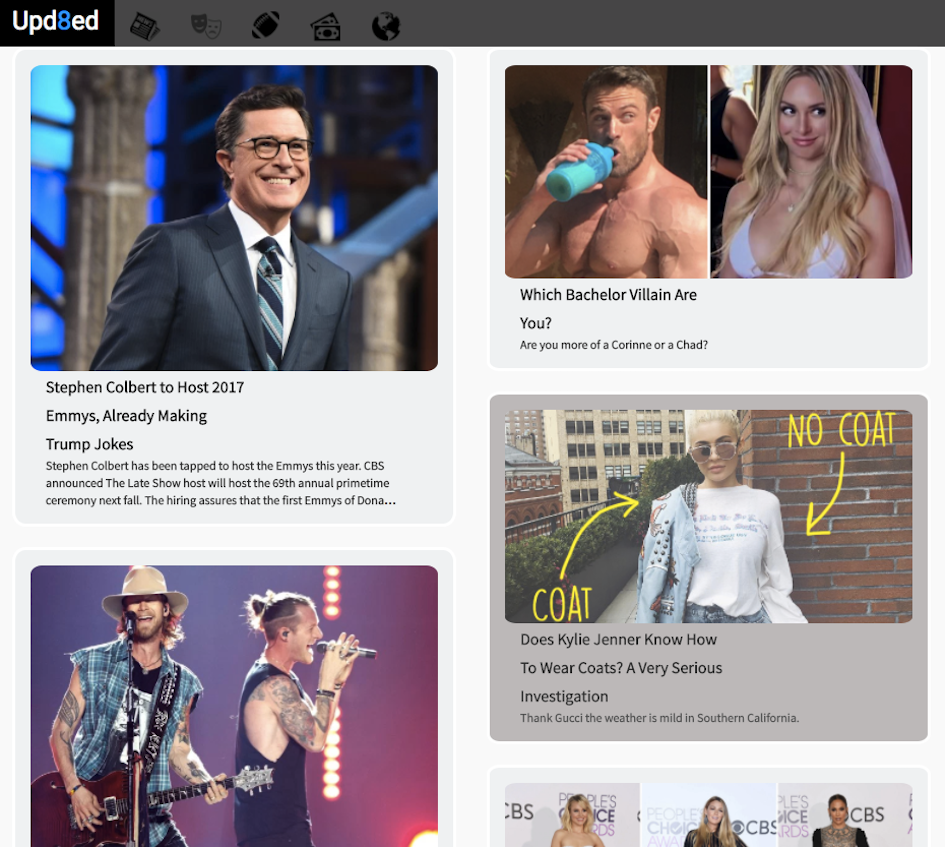

# Aggregated

## Description/Overview
A news aggregator, is a demonstration of the front-end skills we have learned during our time thus far in coding bootcamp. We have created a one-stop shop by pulling the latest business, entertainment, global, sports news from a variety of sources for the viewer. Upd8ed replicates the functionality of google news with the influence of Reddit.com and Pinterest.com.

## Technologies
The following languages, frameworks and APIs were used:

<div align="center">

 


</div>
<br><br>    


## Challenges and Solutions
1.  **Challenge:** Organizing styling and layout when working with ReactDOM, bootstrap, and original CSS. Certain layouts conflicted with how we wanted to style each page using Bootstrap. 

   **Solution:** This was an issue throughout the entire project. We developed unique solutions for each page depending on what best fit it. With the entertainment page, the code was rewritten to allow for easier styling and reduce unecessary white space. 

2. **Challenge:** Search page that allows us to sort through the results. 
The news api we were using did not have a keyword property in each of their articles. We had 60 news sources, each giving us their current top 10 articles, so we awere able to pull 600+ different articles, but without a way to sort through them.

  **Solution:**
First we made a global array of all the news sources (60 items), Then we made the ajax calls for each source and added all 600 articles into an array saved in the state of the parent component. The array of articles are then passed to the child component as props, where we built a quick sorting algorithm. From the input box component, we got the user input value and passed it up to its parent where routing happens. As input changes we went to a new route with the input value as the parameter. This input value is then passed all the way down to the child component which contains all the articles. Next, we looped through the titles of the articles looking for matches with whatever words user typed in. Those articles are rendered on the right. At onClick of each article, the article data is sent to the parent component through a parameter in a function, and sent back down to a description component where it displays the image, link to full article, etc.

## Code Snippets and Screenshots

Although not necessarily apparent in this screenshot, the stocks on the left side of the page are constantly being updated. Notice also that header below the nav bar displays up to date information on whether a stock market is currently open as well as the local time. 




This is accomplished by the code below:

```js

var symbol = 'BAC+FB+TSLA+WPX+WFC+RAD+FCX+AAPL+F+GE+JCP+JPM+VALE+FCAU+FTI+T+GOOG+S+DOW+TWTR+CSCO+INTC+QQQ+MU+XIV+NVDA+NFLX+JNJ+HBAN+ARRY+CMCSA+TVIX+GRPN+ARIA+MSFT+SIRI'
var stockFront = 'http://query.yahooapis.com/v1/public/yql?q=select%20*%20from%20yahoo.finance.quotes%20where%20symbol%20in%20("'
var stockTail = '")%0A%09%09&env=http%3A%2F%2Fdatatables.org%2Falltables.env&format=json'
var stockUrl = stockFront + symbol + stockTail

//parent of Stock.js, StockSearch.js, StockMarkets.js
class Stocks extends Component {
    constructor(props) {
      super(props);
      this.state = {stocks: []};
      this.componentDidMount = this.componentDidMount.bind(this);
  };
    componentDidMount() {
    $.getJSON(stockUrl, (stockData) =>{
      var stockArr = stockData.query.results.quote
      var stockArrMin = []
      for(let i = 0; i < stockArr.length; i++){
        if(stockArr[i].symbol!==null){
          if(stockArr[i].DaysHigh==null){stockArr[i].DaysHigh = "-"};
          if(stockArr[i].Change==null){stockArr[i].Change = "0"};
          // changed stock.Change to yearly change for display on weekends
          var eachStock = {
            symbol: stockArr[i].symbol,
            price: stockArr[i].LastTradePriceOnly,
            change: stockArr[i].ChangeFromFiftydayMovingAverage,
            name: stockArr[i].Name
          }
          stockArrMin.push(eachStock)
        }
      }
      this.setState({stocks: stockArrMin})
    });   
    }

    render() {
      //left column hidden in phone
      if(this.state.stocks.length > 4){
        return(
          <div>
          <StockHeader />
          <div className='hidden-sm hidden-xs'>
              <StockSearch />
              <Stock stocks={this.state.stocks} />
            </div>
          </div>
      )
    }else{
      return(
        <div>
          <StockHeader />
          <div className='blinkingLetters' style={{marginTop:35,fontSize: 30,position:'fixed',marginLeft:10}}>Loading Stocks...</div>
        </div>
      )
    }
    }
}


export default Stocks;
```

For visual appeal, we put the top ESPN news in a slider and displayed the entertainment articles in a Pinterest-inspired layout. We used [Kiran's](https://github.com/akiran) open-source slider.

```js
import SportsHome from './SportsHome';
import giveToSliderPhoto from './SportsHome';
var React = require('react');
var Slider = require('react-slick');


var SimpleSlider = React.createClass({
 render: function () {
   var settings = {
     dots: true,
     speed: 500,
     slidesToShow: 1,
     slidesToScroll: 1,
     autoplay: true,
     autoplaySpeed: 4000,
     adaptiveHeight: true,
     arrows: false,
     pauseOnHover: true,
     useCSS: true,
     centerMode: true,
     variableWidth: true
 
   };

   // console.log(this.props.articles)
   var imgURL = []
        {this.props.articles.map(function(article, index){
         imgURL.push(<div className="anna" key={index}><a target="_blank" href={article.url}>
                       </a></div>)}
       )}
   var titles = []
     {this.props.articles.map(function(article, index){
       titles.push(<div className="row slider_titles" key={index}><a target="_blank" href={article.url}>{article.title}</a></div>)
     })}

   return (
     
     <div className="slider">
       <Slider{...settings}>
         <div>
           <div >{imgURL[0]}</div>
           <div>{titles[0]}</div>
         </div>
         <div>
           <div>{imgURL[1]}</div>
           <div>{titles[1]}</div>
         </div>
         <div>
           <div>{imgURL[2]}</div>
           <div>{titles[2]}</div>
         </div>
         <div>
           <div>{imgURL[3]}</div>
           <div>{titles[3]}</div>
         </div>
         <div>
           <div>{imgURL[4]}</div>
           <div>{titles[4]}</div>
         </div>
       </Slider>
     </div>
   );
 }
});

export default SimpleSlider;
```


Here is where it all happens:

```js
var readColor = 'black'
    var authorColor = 'grey'
    var keyWordColor = 'black'
    var keyBg = 'yellow'
    if(this.state.read === 'seen'){readColor='lightgrey'; authorColor='lightgrey'; keyWordColor='lightgrey'; keyBg='none'}

    return(
      <div className='click-article' onClick={this.childOnClick} style={{color:readColor, padding:'10px 20px', borderLeft:'1px solid #ddd',borderBottom:'2px solid #ddd'}}>
        <div style={{fontSize:16}}>
          <div>{this.props.frontText}
            <span style={{backgroundColor:keyBg, color:keyWordColor}}>{this.props.highlightText}</span>
            {this.props.backText}
          </div>
        </div>
        <div style={{marginLeft:2, marginTop:5, fontSize:13, color:authorColor}}>
          <div style={{float:'left'}}>{authorText}</div>
          <div style={{float:'right', marginRight:10}}>{publishText}</div>
        </div>
        <br/>
      </div>
    )
  }
}
```

This is the specific line that tells us how we mark articles as "read":

`if(this.state.read === 'seen'){readColor='lightgrey'; authorColor='lightgrey'; keyWordColor='lightgrey'; keyBg='none'}`


## Stretch Goals
1. Upvote/downvote option for users
2. Option to share articles on social media
3. Backend server
4. Displaying articles in an Iframe modal

## Team Members and Contributions
All team members are full stack web development students of the [DigitalCrafts](http://www.digitalcrafts.com/) November 2016 cohort. This project utilizes our frontend skills that we have learned along with pair programming and SCRUM agile development methodology. We used Taiga to implement a Kanban task scheduling system to practice agile software development. 

# 🌐 Socials: 
<p align="left">
  <a href="https://www.facebook.com/ruban.swe.3" target="blank"></a>
  <a href="https://www.linkedin.com/in/karthik-pp-b80b38237/" target="blank"></a>
  <a href="https://www.instagram.com/ig_._karthik/" target="blank"></a>
  <a href="https://instagram.com/ig_._karthik" target="blank"></a>
  <a href="https://www.youtube.com/@KARTHIK4332" target="blank"></a>
</p>
